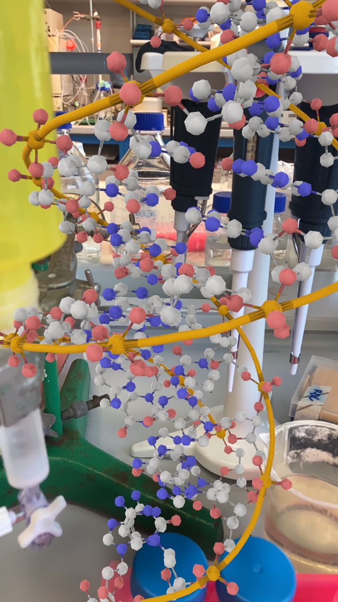
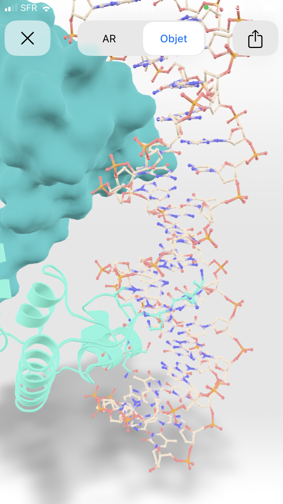

# AR Structural Biology Viewer

This project provides a **free** web-based AR viewer for 3D models for teaching structural biology, optimized for both iOS and Android devices. Students can scan QR codes to view different biological structures in augmented reality or 3D without any specific app.

Be free to clone this repository to add your own 3D models and make your own AR journey.
Contributions are welcome! Please open an issue or submit a pull request if you have any improvements or suggestions.

## Features

- **Cross-Platform Support**: Automatically detects the user's device (iOS or Android) and loads the appropriate 3D model format (USDZ for iOS, GLB for Android).
- **Augmented Reality**: Allows users to view 3D models in AR if their device supports it.
- **Dynamic Model Loading**: QR codes link to specific models, which are dynamically loaded based on the URL parameters.
- **Python script to generate free QR code**: You can easily generate the different QR code to link URL to specific models.
- **Pymol, Chimera and Blender** are use to genrate 3D models. 

## Generating 3D Models for AR Viewer

To create and optimize 3D models for the AR viewer, follow this pipeline using PyMOL, Chimera, Blender, and MeshLab:

1. **Create Your Model in PyMOL or Chimera:**
   - Design your 3D molecular structure or other models using PyMOL or Chimera.
   - Export the model in the VRML 2 format.

2. **Import and Process in Blender:**
   - **Importing the Model:**
     - Open Blender and enable the `Web3D X3D/VRML2` add-on, which allows for importing VRML 2 files.
     - Import the VRML 2 model into Blender.
   - **Processing in Blender:**
     - Refine the model, adjust textures, and prepare it for AR use. Ensure the model's scale and orientation are appropriate.
   - **Exporting to USDZ and GLB:**
     - Export the model in both USDZ (for iOS) and GLB (for Android) formats, ensuring cross-platform compatibility.

3. **Optimizing Large Models with MeshLab:**
   - **Handling Large Structures:**
     - For complex models resulting in large file sizes, use MeshLab to optimize the model using cleanning tools.
   - **Decimation and Cleaning:**
     - Utilize MeshLab's decimation tools to reduce polygon count and make the model more efficient for AR applications.
   - **Final Export:**
     - After optimization, re-export the model in VRML to import with blender to then export in USDZ and GLB formats 

By following this pipeline, you can produce high-quality, optimized 3D models that enhance the AR experience for users.

### Hosting

To host the viewer on GitHub Pages. But you can use any other static site hosting service.

### To add more models
   
   ### 1- Add your 3D model in the IOS directroy (usdz) and in the Android directory (glb)
   
   ### 2- Edit the file: `models.json` 
    Update `models.json` with the appropriate URLs for your 3D model files.
    ```json
    {
        "model1": { "ios": "a-helix.usdz", "android": "a-helix.glb" },
        "model2": { "ios": "beta-sheet.usdz", "android": "beta-sheet.glb" },
        ...
    }
    ```

   ### 3- Generating QR Codes

Generate QR codes that link to your hosted `models.json` with the appropriate model query parameter.
 For example:
- **Alpha Helix**: `https://jmb-scripts.github.io/AR-Structural-Biology/index.html?model=model1`
- **Beta Sheet**: `https://jmb-scripts.github.io/AR-Structural-Biology/index.html?model=model2`
- **DNA**: `https://jmb-scripts.github.io/AR-Structural-Biology/index.html?model=model3`
- **mCherry**: `https://jmb-scripts.github.io/AR-Structural-Biology/index.html?model=model4`
- **B-galactosidase**: `https://jmb-scripts.github.io/AR-Structural-Biology/index.html?model=model5`
- **Haemoglobin**: `https://jmb-scripts.github.io/AR-Structural-Biology/index.html?model=model6`

   You can use a QR code generator Qr-code.py in QR-Code/:

   1. **Edit Qr-code.py**
   change the URL line 25 with the proper model number
   2. **Then in a terminal type:**
      **`python Qr-code.py`**
  
## Usage

### Viewing Models

1. **Scan the QR Code**: Use a QR code scanner on your mobile device to scan the QR code associated with the desired model.
   (for ipad make sure that safari is in mobile version)
   
## QR Codes
Here are some QR codes for each model:
### Alpha Helix


### Beta Sheet


### DNA


### mCherry


### Haemoglobin


2. **Open the Link**: The link will direct you to the web viewer, which will automatically detect your device and load the appropriate model depending of iOS or Android.

3. **Click on the cube at the bottom right**


4. **See the magic, your model in your world**


5. **Display just the 3D model without AR**
  You have the possibility to just display the model in 3D by clicking on 3D


## Thx
to @Allister_crow for its walkthrough on the use of AR for structural biology.
to chatgpt because HTML is not my friend.
